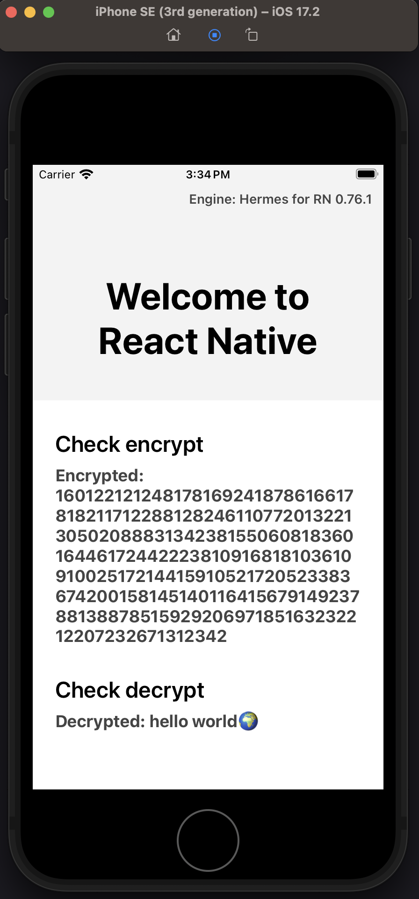

# eciesjs-rn-demo

## Setup

See: <https://reactnative.dev/docs/set-up-your-environment>

## Install

```bash
pnpm install
```

## Run

Start React Native packager first.

```bash
pnpm start
```

Install ios dependencies via `cd ios && npx pod-install`

Then

```bash
pnpm build:ios && pnpm run ios
```

Android is not tested yet, you need to try building it on your own.

## Screenshot


